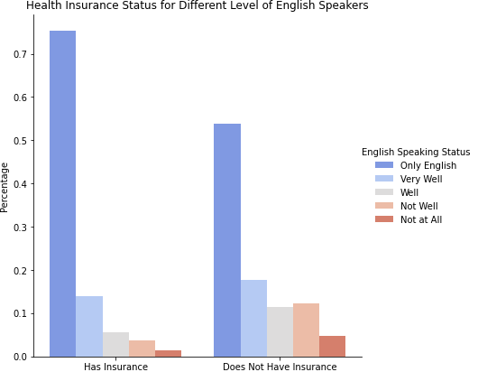

# New York State Health Insurance Model
### Project by Paul Torres and Albert Um

This repository contains the data collection, cleaning, and analyses of American Community Survey (ACS) information from 2018. We were initially focused on New York State with the hopes of eventually applying the model to the rest of the country. The data was donwloaded from the Census Bureau — and included housing and persons records.

# Overview

For this project, we aim to analyze the sampled New York State population in order to identify key community characteristics in order to predict whether or not a person was covered by health insurance. We started off with a large number of features to base our predictions on, which we then whittled down using various statistics tests and feature selection. We then used the model to see if it could generalize against unseen data from other states.

# Structure of Repository
- Experimental Notebook (Folder) — notebooks for techniques not included in README
- PNG (Folder) — contains images created during EDA and those linked in README
- Data_Cleaning.ipynb — contains all processes that went into pipeline cleaning and statistical tests
- Model_Evaluation.ipynb — contains code that ran all of the models for NYS data
- Alabama_Test.ipynb — contains case where NYS model predicts onto Alabama data
- Final_Columns.txt — contains a working dictionary for the columns that ended up in the final dataframe
- 001-Covariate_Analysis.ipynb — notebook that contains information about covariate shift
- README.md

# Business Case
1. Marking a Target/Identifying Stakeholders
	- To whom does it matter if we can identify who does or does not have health insurance?
		1. **Health Insurance Companies**:  
		Where do they market premium plans?
		2. **HealthCare.Gov**:  
		What communities should they target to sign up for ObamaCare?
		
2. Understanding how different states may offer health insurance at different levels 
	- Do some states offer medicare at different levels? 
	- Are the factors that affect whether an individual has healthcare change from state to state? 
	- How many vairables are important in determining whether someone has health insurance? 
	
3. Understanding the viability in different models
	- Is it more productive to build a predictive or interpretable model? 
	- Which model would be the most helpful for a stakeholder? 

# Data
Before we dive deeper into the questions, here is some information on our data. 
1. The data is focused on New York State and Alabama in 2018.
2. The data was compiled and then uploaded to Kaggle.
    - You can find the dataset [here](https://www.kaggle.com/dataset/c2718fecee72695dff45f4dee01de58deeb17a54a6f334075ac983144be49f63). 
    - The data dictionary can be found [here](https://www2.census.gov/programs-surveys/acs/tech_docs/pums/data_dict/PUMS_Data_Dictionary_2018.pdf?#).
3. All other features were engineered. 

## Descriptive Statistics
Now we will briefly discuss what our dataset contains. 
1. HICOV: The target variable has a large class imbalance--with those with insurance being the majority by a large margin.  
	

2. Distribution of Age Count Over Target Variable.  

3. Distribution of Age Percentage Over the Target Variable.  

# Process
Targeting underserved communities and total participation was the primary goal, we explored data and strived to help our stakeholders as below. 

## Understanding the profile of a person that is more likely to not have health insurance.

For the purpose of this study, we have decided not to include any obersvations of people under the age of 18. While their data is varied and numerous, they cannot apply for programs that bestow health insurance or be employed at occupations that provide it. Their status depends entirely on their guardians -- whether that is a person or the state.

There were several subsets of the population that we wanted to look at. 
The first being Military Status.
    

The second being level of English fluency the person is.

The third being type of personal relationship.

### Modeling

We chose to use Precision as our target metric. The logic being that a false positive would be the worst case scenario for our model. Predicting that someone had insurance when they did not meant losing out on a large part of our audience. A false negative would mean our model was not a efficient but would still serve its primary purpose. Precision was the formula that was sensitive to that because it punished false positives more harshly.

We ran several models, including a dummy classifier, Logistic Regression, Random Forest Classifier, and a Light Gradient Boosting Machine. 

The Dummy Classifier was used to show what would happen if the model just chose the pre-determined (in this case, the majority class of having health insurance). It showed us that the data set was heavily in favor of those with health insurance and any gain we could achieve from our models would have to be able to predict the minority class. 

For the predictive models, the outcomes were very similar but the Logistic Regression edged the rest of them out in terms of its Precision score. We included the F1 score as an overall meter of where the models lay but its balanced approach to scoring was less important because a false negative was not a dealbreaker. 

### Logistic Regression Performance

Taking a look at the confusion matrix, we can see that it misclassified some people that had insurance as not having, which does not hurt the business case. However, it has a low amount of assuming someojne has health insurance.

### Logistic Regression Coefficients

The advantage to picking a model like Logistic Regression is that it can highly interpretable. Using this model allows us access to the coefficients that the model used in order to fit the data. 

### Alabama Data

We then turned out attention to the Alabama dataset. We wanted to see how the model would fit the policies from a state that viewed expanded Medicare so differently. 

Comparing the Confusion Matrix to that of NYS, we see that it had a harder time misclassifying false positives. 

# Conclusion
Our model, using our desired metrics, was fit to our data very well. It ran with a high precision score and allowed for high levels of interpretation. However, we would like to decrease the dimensions using a technique like Principal Component Analysis. 

# Further Steps

We would like to run further tests on datasets that contain the same information as the Census data but for very different populations and places with different policies than New York. 

In the future, deep learning techniques like MLP will be used in order to determine 

# Recommendations
1. The health insurance industry would be better served by a model that took a holistic look at the target audience
2. Use this modeling information to target areas where demographics that fit these features are clustered
3. Fitting models to similar states in bins, in terms of policies, would serve to bring a level of precision that could achieve maximum efficiency. 

