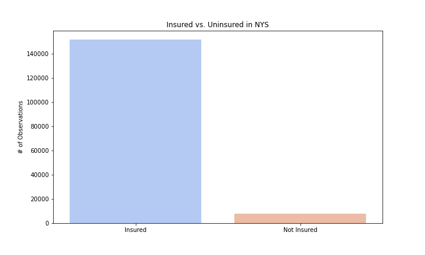

# New York State Health Insurance Model
### Mod 3 Project by Paul Torres and Albert Um

This repository contains data collection, cleaning and analyses of census survey information for 2018. We were singularly focused on New York State. We downloaded and curated data from the Census Bureau -- and included housing and persons records.

# Project

For this project, we aim to analyze the sampled New York State population in order to identify key characteristics in order to predict whether a person was covered by health insurance. We started off with a large number of features to base our predictions on, which we then whittled down using various statistics tests and feature selection. We then used the model to see if it could generalize against unseen data from other states.

# Structure of Repository
- PNG -- contains images created during EDA and those linked in README
- jupyternotebooks -- contains additional topical analyses notebooks
- 001.data_collection.ipynb -- contains codes for collecting and cleaning data
- 010.Data_Analysis_Overview.ipynb -- contains descriptive analyses and other overview analyses
- 011.Data_Analysis_People.ipynb -- contains analyses on directors, writers and casts
- 012.Data_Analysis_Synopsis.ipynb -- contains analyses on most frequent words in overview/synopsis 
- README.md

# Business Case
1. Marking a Target/Identifying Stakeholders
	- To whom does it matter if we can identify who does or does not have health insurance?
		1. **Health Insurance Companies**:  
		Where do they market premium plans?
		2. **HealthCare.Gov**:  
		What communities should they target to sign up for ObamaCare?
		
2. Understanding how different states may offer health insurance at different levels 
	- Do some states offer medicare at different levels? 
	- Are the factors that affect whether an individual has healthcare change from state to state? 
	- How many vairables are important in determining whether someone has health insurance? 
	
3. Understanding the viability in different models
	- Is it more productive to build a predictive or interpretable model? 
	- Which model would be the most helpful for a stakeholder? 

# Data
Before we dive deeper into the questions, here are some information on our data. 
1. The data is focused on New York State in 2018.
2. The data here was compiled and then uploaded to Kaggle.
    - You can find the dataset [here](https://www.kaggle.com/dataset/c2718fecee72695dff45f4dee01de58deeb17a54a6f334075ac983144be49f63). 
    - The data dictionary can be found [here](https://www2.census.gov/programs-surveys/acs/tech_docs/pums/data_dict/PUMS_Data_Dictionary_2018.pdf?#).
3. All other features were engineered. 

## Descriptive Statistics
Now we will briefly discuss what our dataset contains. 
1. HICOV: The target variable has a large class imbalance--with those with insurance being the majority by a large margin.  
	

2. Distribution of Age Count Over Target Variable.

3. Distribution of Age Percentage Over the Target Variable.

# Process
With targeting underserved communitieis and total participation in mind, we explored data and strived to help our stakeholders as below. 

## Understanding the profile of a person that is more likely to not have health insurance.

For the purpose of this study, we have decided not to include any obersvations of people under the age of 18. While their data is varied and numerous, they cannot apply for programs that bestow health insurance or be employed at occupations that provide it. Their status depends entirely on their guardians -- whether that is a person or the state.

There were several subsets of the population that we wanted to look at. 
The first being Military Status.
    

The second being level of English fluency the person is.

The third being type of personal relationship.

### Modeling

#### Baseline Model

Animation, action and adventure movies on average have high worldwide gross revenue compared to other genres. These genres also have relatively high production budget. 

### Is there any difference in domestic vs. global market in types of movie people consume?

We see here that in the global market, even some of the lower production budget films have a potential of gaining high revenue. Bohemian Rhapsody and Coco are examples of such cases. It's important to note that these films were explicitly targeting the global market with universally common sentiment and worldwidely popular topic.

(Correlation between production budget and worldwide gross is slightly higher (r > 0.77) than that between budget and domestic gross (r > 0.68), but both are significant.)

# Conclusion
We reviewed the movie data from the past decade to propose a few recommendation and guideline to start a movie studio. Our focus was on building a sustainable brand by focusing on virality and targeting the global market. We looked at the current market in terms of budget, revenue, and compared global market and domestic market. We reviewed the change of trend and proposed some reasonable investment choices to reach our goal. An annual plan to synergize productions of two separate lines of films (profitable animation and award-worthy biography) was suggested. Additionally we looked at keywords associated with the popularity of films. Throughout, we also posed a couple limitations in our approach that require further investigation of the data.

# Recommendations
1. Explicitly target global market
	Investigate deeper into keywords such as diversity, music, gaming and bollywood
2. Invest in animation or adventure films for all ages to maximize gains and expand the brand presence
3. Make lower-budget biography films targeting award nomination to elevate the brand image

